# HTML & CSS design and build websites  Exersise Sample Codes and Sample Outputs

This repository contains the **HTML + CSS** source code that I have writen while studying the "*HTML & CSS design and build websites*" book by Jon Duckett. The repository contains a comprehensive list of the html and css codes that I found useful to recreat as practice.
The repository is divided into numbers representing the chapters of the book.

# HTML + CSS Chapter 11: Color
Chapter Project Sample Output:
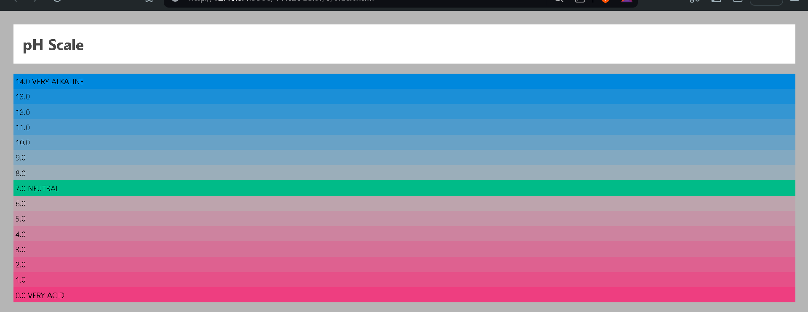
1. Simple Background Color Setting
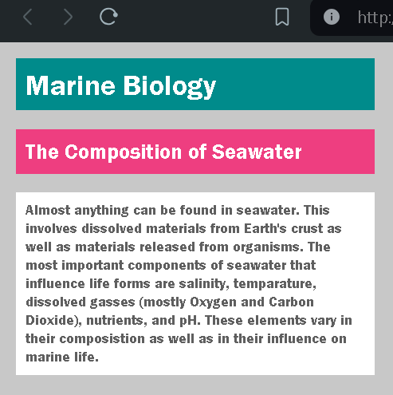
2. Opacity Manipulation of Colors
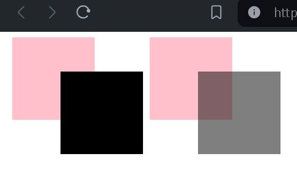

# HTML + CSS Chapter 13: Boxes
Chapter Project Sample Output:
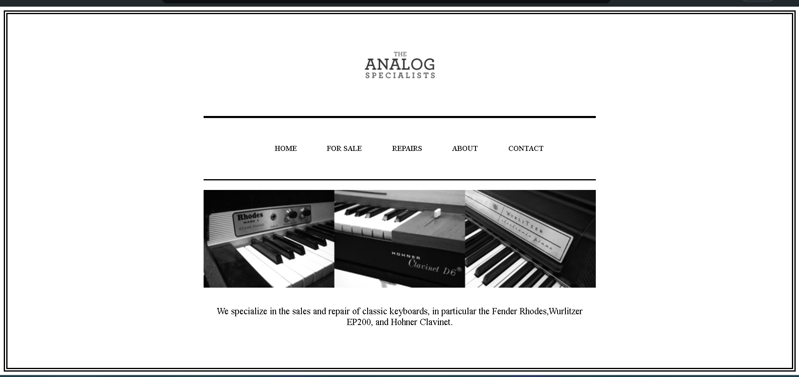
1. Ecommerce Format
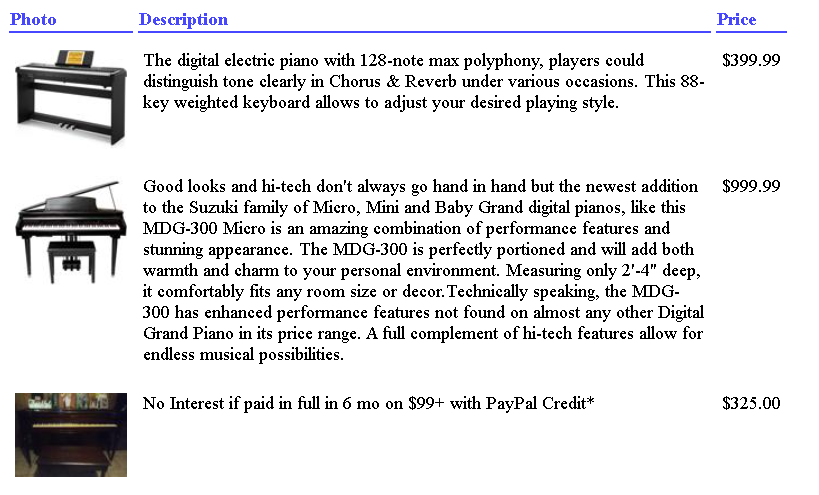
2. Hiding VS Scrolling extra text
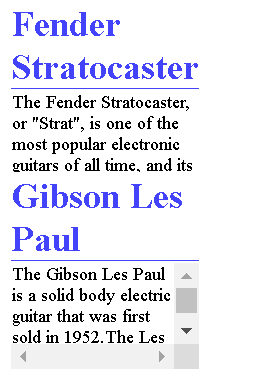
3. Different types of border outlines
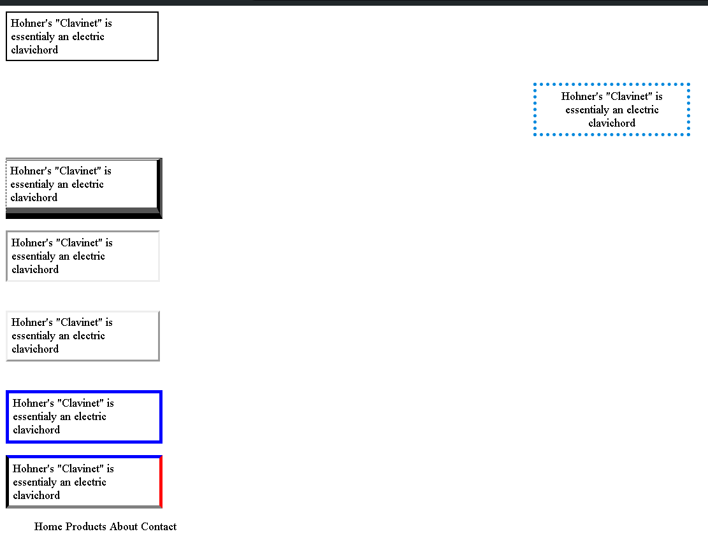

# HTML + CSS Chapter 14: Lists, Tables and Forms
Chapter Project Sample Output:
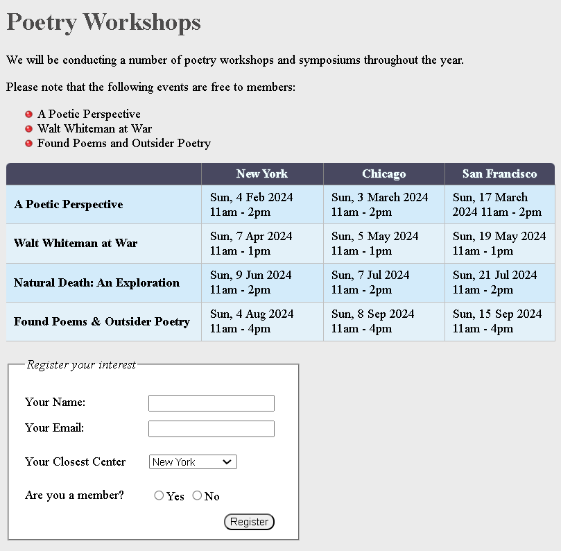
1. Ordered List with Roman Numerals
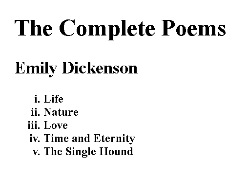
2. Unordered List with Customized Bullet Icons
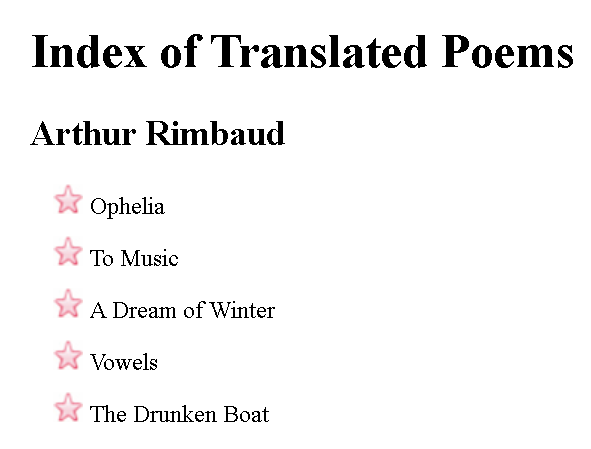
3. Unordered List (Bullet Included in Parapgraph)
> 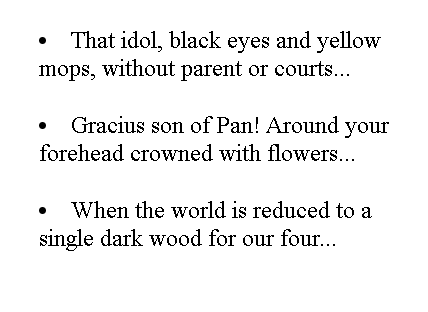
> 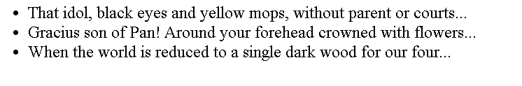
4. Unordered List, More Bullet Styling
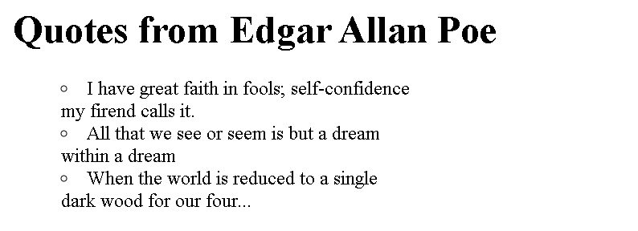
5. Tables: Alternating Row Colors
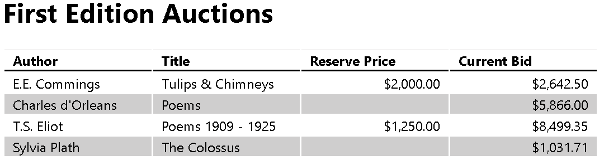
6. Various Cell Styling within a Table
> 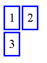
> 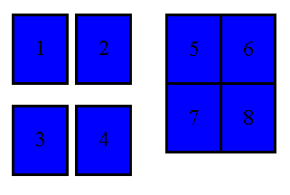
7. Different Form Inputs
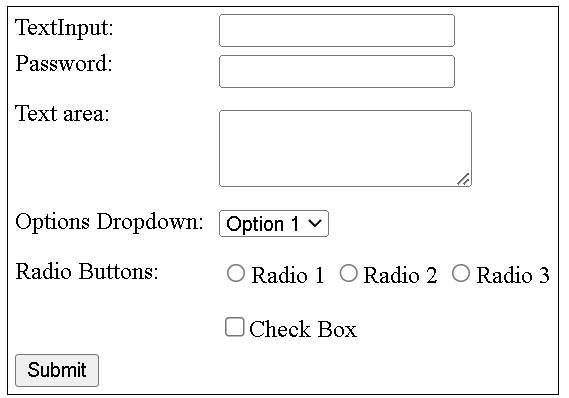
8. Setting Icons for Form Inputs
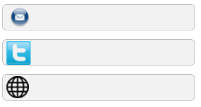
9. Interactive (3D-Effect) Button Styling

10. Form Fieldset and Legend + Interactive Button
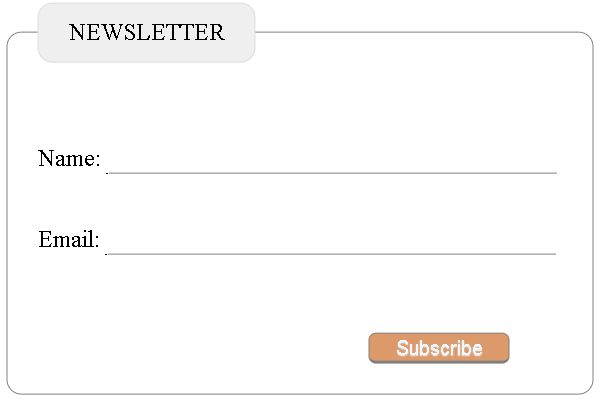
11. More on Form Styling
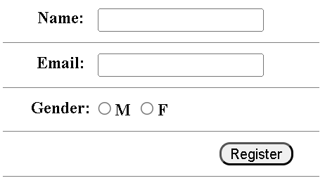
12. Cursor Styling 

# HTML + CSS Chapter 15: Layouts
Chapter Project Sample Output:
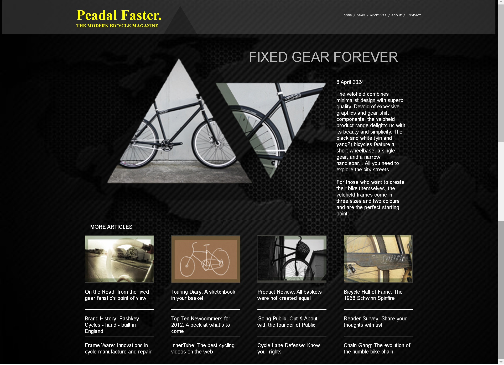
1. Blobk-level vs Inline elements
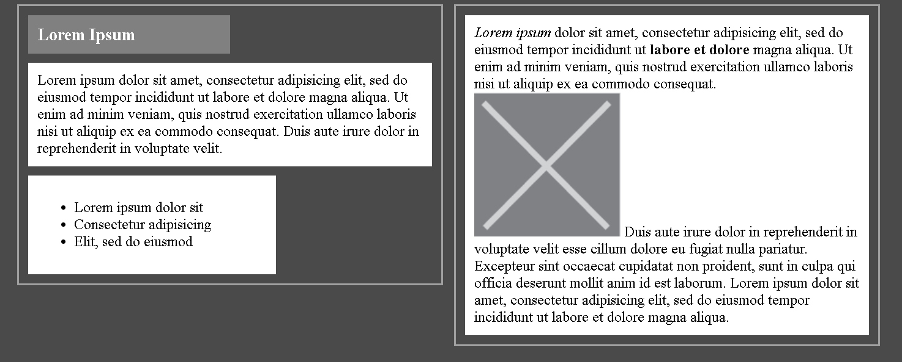
2. Element containment and float elements while preserving container height
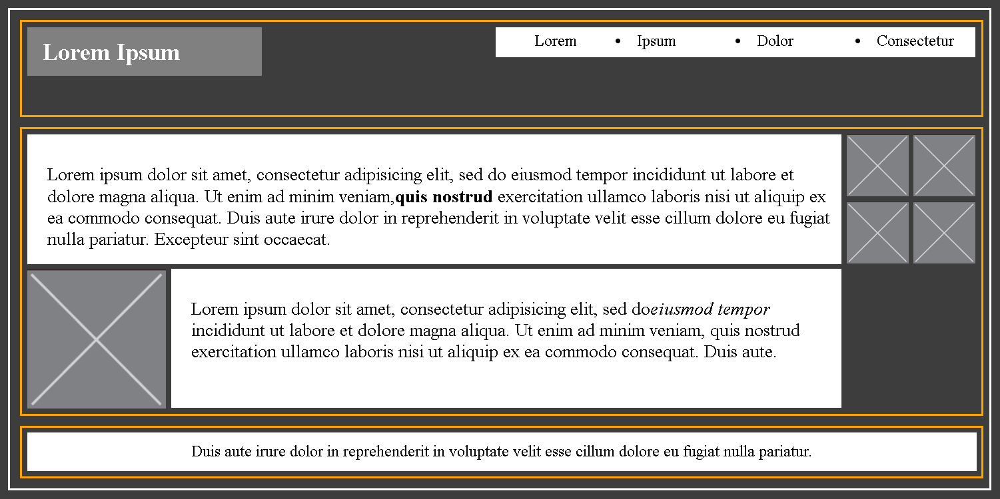
3. Fixed header with scrollable content
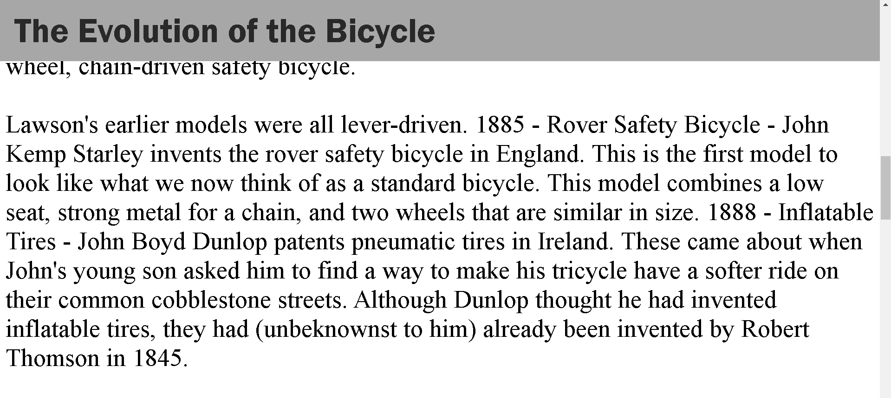
4. Quote display
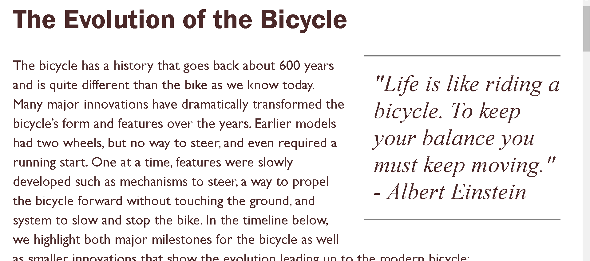
5. Clearing floats, preserving height of parent of floating elements, displaying paragraph sections as floats.
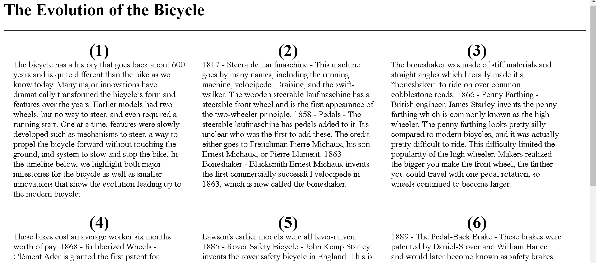
6. More styling exercise
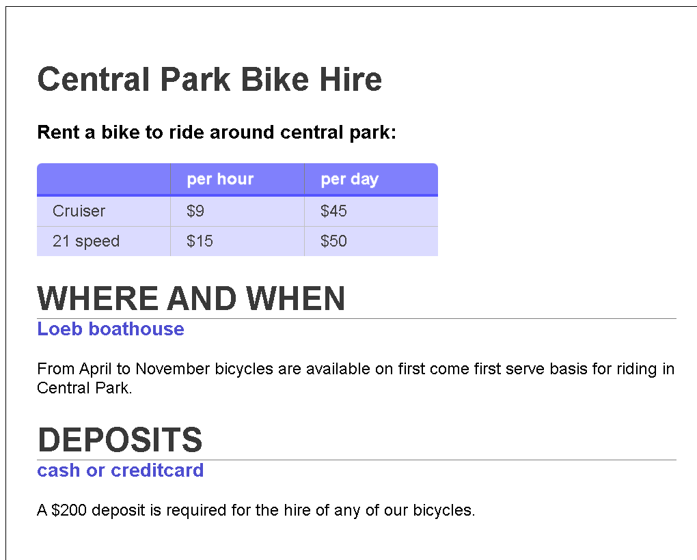